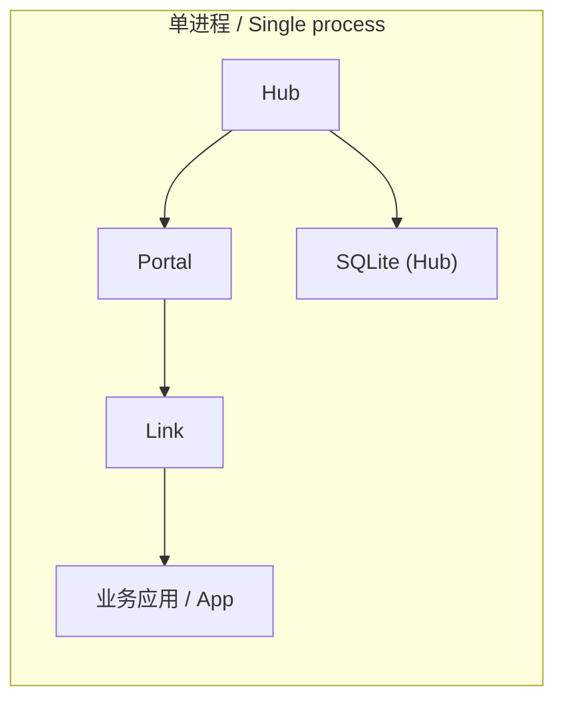

# 04 · Standalone Development / 单进程开发

> Bilingual. Code is shared. / 双语，代码共享。

Standalone 把 Hub、Portal、Link、业务应用装进**一个进程**。启动顺序 Hub -> Portal ->
Link -> 业务应用；关停逆序。Hub 用进程内 Redis，Link/Portal 用 inproc 端点，无需预先启动
任何运行时服务。最适合学习、第一个应用、本地单进程开发与集成测试。

Standalone assembles Hub, Portal, Link, and one business app in **one process**.
Startup order: Hub -> Portal -> Link -> app; shutdown reverses. Hub uses in-process
Redis; Link/Portal use inproc endpoints. Best for learning, the first app, local
single-process dev, and integration tests.

## Minimal app / 最小应用

```go title="main.go"
package main

import (
    "go.yorun.ai/vine/app"
    "go.yorun.ai/vine/app/standalone"
    "go.yorun.ai/vine/core/logger"
)

type HelloModule struct {
    app.BaseModule
}

func (*HelloModule) AfterAppStart() {
    logger.Info("hello from Vine")
}

type HelloApp struct {
    app.Application
}

func (*HelloApp) Name() string { return "demo.hello" }

func (*HelloApp) InitModules(add app.TypeAdder) {
    add(app.T[*HelloModule]())
}

func main() {
    standalone.NewWithOption[*HelloApp](standalone.Option{
        SQLiteFile: "./vine.sqlite",
    }).StartAndWait()
}
```

`StartAndWait()` 启动运行时并等 `SIGINT`/`SIGTERM`；`Ctrl+C` 后按逆序优雅关停。首次运行
会在当前目录创建 `vine.sqlite` 存放 Hub 数据；再次运行复用。/ `StartAndWait` waits for
SIGINT/SIGTERM then shuts down in reverse. First run creates `vine.sqlite` for Hub state;
later runs reuse it.

## Option fields / 选项字段

```go
standalone.NewWithOption[*CheckoutApp](standalone.Option{
    SQLiteFile:   "./hub.sqlite",   // Hub 数据库（SQLite）/ Hub DB (SQLite)
    // PostgresURL: "postgres://...", // 或 PostgreSQL / or PostgreSQL (pick one)
    SeedYAMLFile: "./seed.yaml",    // 导入配置种子 / import config seed
    DashboardURL: "http://:7099/",  // Hub Dashboard 资源 URL / dashboard assets URL
})
```

`standalone.Option`: `SeedYAMLFile`, `SQLiteFile`, `PostgresURL`, `DashboardURL`.
Pick exactly one of `SQLiteFile` / `PostgresURL`. / 二选一。

## What standalone started / standalone 启动了什么



- **Hub** 存配置与注册，提供进程内 Redis。
- **Portal** 订阅入口/站点/端点配置。
- **Link** 连接业务应用，提供配置/发现/转发；最小 App 无公开能力，暂无可广告的内容。
- **App** 业务应用；组件/模块/Rpc/Web/Event/Task 在此扩展。

## Characteristics and limits / 特性与限制

- 只需一个业务二进制，是[第一个应用教程](https://vine.yorun.ai/docs/tutorial-first-app)的最佳模式。
- `standalone.Option` 可配 SQLite/PostgreSQL、种子 YAML、Dashboard URL。
- **Hub 与 Link 跳过心跳、TTL 租约续期、注册 sweeper**；注册在应用停止时显式移除。
- Hub 与 Link 不暴露独立管理端口；Portal 仍可按入口规则监听业务 HTTP/HTTPS 端口。
- **不覆盖跨进程网络、独立服务重启、租约/心跳语义**。需要这些时切 linked/separated。
  / Doesn't cover cross-process networking, independent restarts, or lease/heartbeat
  semantics. Switch to linked/separated when you need them.

> Standalone 通过 = 业务装配正确，**不**等于分布式部署就绪。/ Passing standalone proves
> business assembly, **not** distributed deployment readiness.

<a id="testkit"></a>

## testkit — integration testing / 集成测试

`app/testkit` 在测试里启动 standalone 运行时、覆盖配置、创建类型安全 client。适合覆盖 DI、
Rpc handler、Event listener、Task runner 的集成测试。

`app/testkit` starts a standalone runtime in tests, overrides configuration, and creates
type-safe clients. Good for integration tests covering DI, Rpc handlers, Event listeners,
Task runners.

```go title="greeting_test.go"
func TestGreeting(t *testing.T) {
    runtime := testkit.StartStandalone[*GreetingApp](t, testkit.Option{})
    execution := runtime.NewExecution(testkit.ExecutionOption{
        Actor: meta.NewAnonymousActor(),
    })
    client := execution.NewClient[skeled.GreetingServiceClient]()

    got := client.Hello("Vine")
    require.Equal(t, "Hello, Vine", got.Message)
}
```

测试规则 / test rules:
- Vine App 在测试进程内是 **singleton**：每个测试包只起**一个** standalone runtime，多个用例
  用 `t.Run(...)` 子测试共享，不要在多个 test 里重复建 App。/ One standalone runtime per
  test package; share via `t.Run` subtests.
- 测试聚焦可观测行为：返回值、状态变化、配置覆盖、错误码。/ Focus on observable behavior.
- 只在需要测真实租约/断网/TLS 入口时才单独起 Hub/Link/Portal 进程。/ Start separate
  Hub/Link/Portal processes only for real lease/network-loss/TLS tests.
- 不要在共享全局注册表/全局 logger/应用 singleton 的包里用 `t.Parallel()`，除非已证明隔离。
  / No `t.Parallel()` where global registries/loggers/singletons are shared.
- 测试与源码同目录（`service.go` <-> `service_test.go`），用 `t.Cleanup` 还原全局。
  / Tests beside source; restore globals with `t.Cleanup`.

```bash
go test ./...
go test ./path/to/package -run TestName
```

## First-app flow / 第一个应用的流程

```bash
mkdir vine-hello && cd vine-hello
# 或直接拷贝 skill 脚手架 / or copy the skill scaffold:
#   cp -R <skill>/templates/vine-standalone .
go mod init example.com/vine-hello
go get go.yorun.ai/vine@latest
go install go.yorun.ai/vine/cmd/vine@latest
go install go.yorun.ai/skelc/cmd/skelc@latest
# 写 main.go（见上），然后 / then:
go run .
```

下一步：用 `.skel` 写第一个契约并 `skelc gen go` 生成类型安全代码，再按 Rpc 指南注册实现。
/ Next: author a `.skel` contract, run `skelc gen go`, then register the implementation.

```bash
skelc check  --skel-in ./skel
skelc gen go --skel-in ./skel --go-out ./skeled
```
