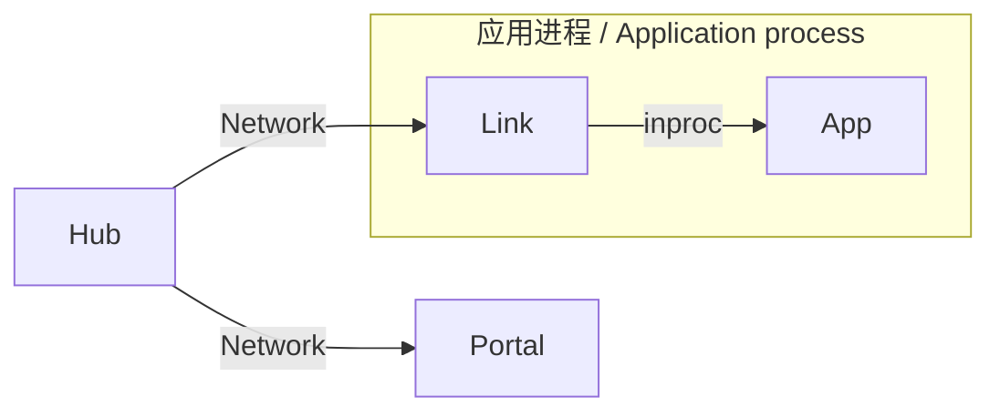
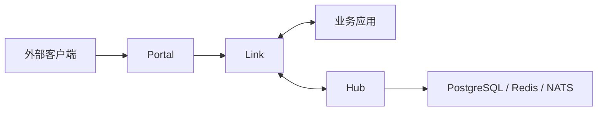

# 05 · Microservice Development / 微服务开发

> Bilingual. Code is shared. / 双语，代码共享。
>
> In Vine, "microservices" = multiple Vine apps communicating through Link/Hub via
> Rpc/Event/Task, deployed in **linked** or **separated** topology. The same business
> code runs standalone; only the runtime boundary changes.
> / Vine 里"微服务"= 多个 Vine 应用通过 Link/Hub 用 Rpc/Event/Task 通信，按 linked 或
> separated 拓扑部署。业务代码不变，只换运行时边界。

## Mode comparison / 模式对比

| Mode | Hub / Portal / Link | 业务应用 | Recommended for |
| --- | --- | --- | --- |
| standalone | 同进程 | 同进程 | 快速上手、测试、本地单体 |
| **linked** | Hub/Portal 独立；Link 随应用进程 | 与 Link 同进程 | 本地开发、少量服务、简化部署 |
| **separated** | Hub/Portal/Link 全独立 | 独立进程 | 生产、独立扩缩容、故障演练 |

## Linked: separate Hub and app / linked 模式

Hub 与 Portal 作为独立运行时服务，每个业务应用在自己进程里带一个 inproc Link。



先起 Hub（需要时再起 Portal）:

```bash
vine hub serve \
  --mq-embedded-nats \
  --db-sqlite-file ./hub.sqlite

vine portal serve \
  --hub-endpoint http://127.0.0.1:7071
```

业务应用导入 `go.yorun.ai/vine/app/linked`:

```go title="cmd/checkout/main.go"
func main() {
    linked.NewWithOption[*CheckoutApp](linked.Option{
        HubEndpoint:   "http://127.0.0.1:7071",
        IngressListen: "127.0.0.1:7082",
    }).StartAndWait()
}
```

`HubEndpoint` / `IngressListen` 也可来自 `VINE_HUB_ENDPOINT` / `VINE_INGRESS_LISTEN`。
该模式保留独立 Hub 的配置/注册/租约语义，但 Link 与业务应用仍一起发布、一起停止。适合
不想单独跑 Link sidecar 的场景。/ Keeps an independent Hub's config/registration/lease
semantics, but Link and the app release and stop together.

## Separated: independent runtime and app / separated 模式

生产里把控制面、外部入口、应用侧接入层、业务应用拆成独立进程。



本地最小启动顺序 / minimal local startup sequence:

```bash
# 1. 控制面 / control plane
vine hub serve \
  --mq-embedded-nats \
  --db-sqlite-file ./hub.sqlite

# 2. 外部网关（需要外部 HTTP/HTTPS 入口时）/ external gateway
vine portal serve \
  --hub-endpoint http://127.0.0.1:7071

# 3. 应用侧 Link / app-side Link
vine link serve \
  --api-listen 127.0.0.1:7079 \
  --ingress-listen 127.0.0.1:7082 \
  --hub-endpoint http://127.0.0.1:7071
```

业务应用不再用 `standalone.New` / `linked.New`，直接 `app.New`:

```go title="cmd/checkout/main.go"
func main() {
    app.NewWithOption[*CheckoutApp](app.Option{
        LinkEndpoint: "http://127.0.0.1:7079",
    }).StartAndWait()
}
```

```bash
# 或用环境变量 / or via env
VINE_LINK_ENDPOINT=http://127.0.0.1:7079 ./checkout-app
```

该模式下 Link 向 Hub 注册应用并维持心跳；应用、Link、Portal、Hub 各有独立进程生命周期。
外部 Portal 监听、站点规则、TLS 证书通过 Hub 配置管理。/ Link registers apps with Hub and
maintains heartbeats; each process has an independent lifecycle. Portal listeners, site
rules, and TLS are managed through Hub config.

## CLI & env reference / CLI 与环境变量

`vine` 命令（`cmd/vine`）：`hub`/`link`/`portal` 启动运行时服务，`version` 打印版本。

| 服务 / Service | 关键 flag | 环境变量 |
| --- | --- | --- |
| `vine hub serve` | `--api-listen` `--redis-listen` `--mq-embedded-nats`/`--mq-external-nats-url` `--db-sqlite-file`/`--db-postgres-url` `--seed-yaml-file` `--dashboard-url` | `VINE_API_LISTEN` `VINE_REDIS_LISTEN` `VINE_MQ_EMBEDDED_NATS` `VINE_MQ_EXTERNAL_NATS_URL` `VINE_DB_SQLITE_FILE` `VINE_DB_POSTGRES_URL` `VINE_SEED_YAML_FILE` `VINE_DASHBOARD_URL` |
| `vine link serve` | `--api-listen` `--ingress-listen` `--hub-endpoint` | `VINE_API_LISTEN` `VINE_INGRESS_LISTEN` `VINE_HUB_ENDPOINT` |
| `vine portal serve` | `--hub-endpoint` | `VINE_HUB_ENDPOINT` |

Hub 默认 API `127.0.0.1:7071`、内嵌 Redis `127.0.0.1:7073`。Hub 需要**恰好一个** DB
（SQLite 或 PostgreSQL）和**恰好一个** MQ（embedded NATS 或 external NATS URL）。
/ Hub needs exactly one DB and exactly one MQ mode.

## Registration & failure semantics / 注册与故障语义

| Mode | TTL 与 sweeper | Link 心跳 | 本地应用健康检查 |
| --- | --- | --- | --- |
| separated（应用与 Link 独立） | 启用 | 启用 | 启用 |
| linked（inproc Link + 网络 Hub） | 启用 | 启用 | 禁用（Link 与应用同进程） |
| standalone（inproc Hub） | 禁用 | 禁用 | 禁用 |

有网络 Hub 时，注册带租约：Link 靠心跳续约，Hub sweeper 注销过期实例并发布删除事件；
独立运行的 Link 还会检查它拥有的应用。当前实现常量：Link 每 5s 检查应用（2s console-ping
超时，连续 3 次非超时失败后注销）；Hub 租约 30s，sweeper 每 5s 跑。调用超时只记日志，不
计入失败。这些是当前实现常量，**不是** CLI 调参 flag。/ With a network Hub, registrations
carry leases renewed by Link heartbeats; Hub's sweeper removes expired instances. These
timings are current implementation constants, not CLI flags.

## Inter-app communication / 跨应用通信

同一应用内的两个组件通信：**直接 Go 依赖注入**，不要造 Rpc 服务。不同应用之间：用 Rpc
（同步、类型安全请求/响应）或 Event/Task（异步）。所有跨应用调用经 Link 发现与转发；
standalone 用 inproc 端点。/ Same-app components: inject a Go dependency directly. Across
apps: Rpc (sync) or Event/Task (async). Link handles discovery/forwarding; standalone
uses inproc.

### Rpc: define, generate, implement, call / 定义、生成、实现、调用

```skel title="skel/greeting.skel"
pub service GreetingService {
    noauth
    method hello {
        input  { name: string }
        output Greeting
    }
}
```

```bash
skelc check --skel-in ./skel
skelc gen go --skel-in ./skel --go-out ./skeled
```

```go title="internal/greeting/service.go"
// 服务端：嵌入默认实现，实现需要的方法 / server: embed default, implement methods
type GreetingService struct {
    skeled.DefaultGreetingServiceServer
}

func (*GreetingService) Hello(name string) skeled.Greeting {
    return skeled.Greeting{Message: "Hello, " + name}
}
```

```go title="internal/application/app.go"
type GreetingApp struct {
    app.Application
    app.ServicerEnabled
}

func (*GreetingApp) Name() string { return "demo.greeting" }

func (*GreetingApp) ServicerInitHandlers(add app.TypeAdder) {
    add(app.T[*GreetingService]())
}
```

```go title="internal/greeting/probe.go"
// 客户端：注入生成 client 直接调用 / client: inject generated client and call
type GreetingProbe struct {
    app.BaseModule
    Client skeled.GreetingServiceClient `inject:""`
}

func (m *GreetingProbe) AfterAppStart() {
    greeting := m.Client.Hello("Vine")
    logger.Info("greeting received", "message", greeting.Message)
}
```

注入到 Rpc/Web/Event/Task 执行的 client 会**继承**该执行的 trace/initiator/actor；从
module 调用的 client 则代表应用自身发起的后台工作（Vine 新建 trace，发送 absent Actor）。
/ A client injected into an execution inherits its trace/initiator/actor; one injected
into a module represents app-originated background work.

### Trace & timeout propagation / 链路与超时传播

跨 Portal/Link/Rpc 的链路：trace header（`vrpc-trace`/`vweb-trace`）与 options header
（`vrpc-options`/`vweb-options`，目前只带 `timeout`）。超时从入口算起，每次转发前换算成
**剩余时间**。业务代码一般不用手设超时--只要**保留注入的 context**，Rpc client 会读
context deadline 并写剩余时间到 `vrpc-options`。

Trace/timeout cross Portal/Link/Rpc via headers. Timeout starts at entry and is
recomputed to **remaining time** before each forward. Business code usually doesn't set
timeout manually - **keep the injected context** and the Rpc client writes the remaining
deadline automatically.

```go
// 对 / correct: 用注入的 client/context 调下游 / use injected client/context for downstream
result := h.SomeClient.DoSomething(...)

// 错 / breaks propagation: 丢掉了剩余超时 / loses remaining timeout
ctx := context.Background()
```

Portal 默认 Rpc/Web 超时 30s，上限 120s。SSE/WebSocket 无显式超时时不限总时长，60s 无流量
才关。/ Portal defaults to 30s (max 120s) for Rpc/Web. SSE/WebSocket without explicit
timeout aren't total-duration-limited; closed after 60s idle.

## Security boundary / 安全边界（pre-1.0 必读）

组件间认证与加密传输仍是 TODO。内嵌 Hub Redis 当前允许**无密码只读**连接，并分发运行时配置
（含 Portal TLS 私钥）。**不要**把 Hub API、Hub Redis、Link API、Link ingress、应用监听端口、
内嵌 NATS 监听暴露给不可信网络。只绑回环或可信私网，用防火墙/网络策略强制边界。

Auth and encrypted transport between components are still TODO. The embedded Hub Redis
allows password-free read-only connections and distributes runtime config (including
Portal TLS private keys). **Do not** expose Hub API, Hub Redis, Link API/ingress,
app listeners, or embedded NATS to untrusted networks. Bind to loopback or a trusted
private network only.

## Production readiness essentials / 生产就绪要点

- **固定版本**：pin Go + Vine + skelc，不要用 `@latest`；部署镜像里跑同一个 `vine` 二进制；
  Vine/skelc 变了就重新生成契约。/ Pin Go + Vine + skelc; regenerate contracts on upgrade.
- **网络**：清点每个监听端口，只放行所需调用方；Link 与应用不同容器/主机时配可达且不公开
  的应用监听地址。/ Inventory listeners; permit only required callers.
- **Hub 持久化与消息**：恰好一个 DB + 恰好一个 MQ；外部 NATS 需开 JetStream。当前 Event/Task
  流用**内存存储**，不保证跨 NATS/集群重启的磁盘持久化--需要时用数据库 outbox 或外部工作流。
  / Hub needs one DB + one MQ; Event/Task streams are currently memory-backed.
- **关停顺序**（跨进程）：先停外部流量 -> 优雅停业务应用 -> 停其 Link -> 停 Portal -> 最后停 Hub。
  / Cross-process shutdown order.
- **验证**：在 staging 用同拓扑跑：经 Portal 发请求、做一次应用间 Rpc、改 instant 配置/重启
  改 eternal 配置、测 Event/Task 重试与幂等、测优雅替换与实例丢失、重启 Link 验证恢复。
  / Verify in staging with the same topology.
- Vine 不在业务应用上挂通用 `/healthz`；平台需要 HTTP 探活就加**应用自有**、语义匹配其依赖
  的路由，并保留端到端请求检查。/ No generic `/healthz`; add an app-owned probe if needed.

完整清单见 / Full checklist:
[production-readiness](https://vine.yorun.ai/docs/production-readiness)。
