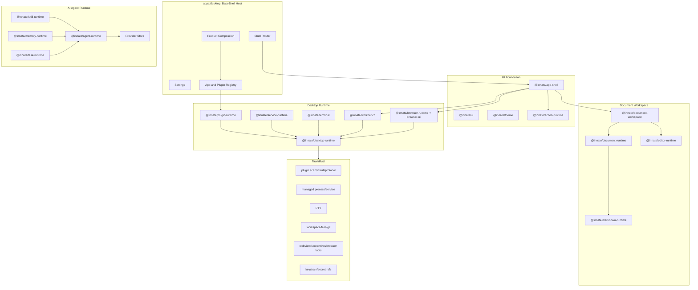

# 目标架构

## 架构结论

以 `innate-ai-desktop` 为主干，把能力拆成稳定 packages 和 Tauri/Rust runtime。Host 只做产品装配、权限边界和 runtime 协调；业务能力通过内置 package、first-party contribution、iframe/webview plugin 或 sidecar service 接入。



## 分层原则

| 层 | 负责 | 不负责 |
|---|---|---|
| Host | 路由、产品组合、settings、权限提示、runtime 注入 | 具体业务 app 逻辑 |
| UI Foundation | 通用组件、主题、shell layout、action slots | 文件、Git、Agent、Plugin 业务状态 |
| Desktop Runtime | Tauri command wrapper、plugin roots、process、terminal、workspace、browser | UI 决策和产品文案 |
| Plugin/Service Runtime | manifest、安装、扫描、service lifecycle、health/logs | 任意第三方 React 动态注入 |
| Agent Runtime | provider registry、profile resolver、run/cancel/events、approval | 直接持久化 secret 明文 |
| Skill/Memory/Task Runtime | local skill scan、memory recall、activity timeline | 隐式执行未经确认的工具 |
| Document Workspace | Markdown 文件模型、编辑器、document toolbar、TOC/inspector | 产品级 vault 业务耦合 |
| Native | 文件/进程/PTY/webview/secret 的受控系统调用 | 产品策略和 UI composition |

## App 接入形态

| 形态 | Runtime | 当前状态 | 目标 |
|---|---|---|---|
| Static Web App | `iframe-static` | 已实现 | 稳定支持导入、安装、plugin protocol |
| Sidecar Web App | `iframe-sidecar` 过渡 | 部分实现 | 升级为 `sidecar-web + services[]` |
| External Web | `external-web` | 已有基础 | 默认外部浏览器或 isolated iframe |
| First-party React Surface | source-level package | 计划中 | 仅限同 repo/shared deps，走 contribution registry |
| Standalone Desktop Product | app-owned Tauri shell | 计划中 | 共享 packages，独立品牌和发布 |

## Plugin Package 与 Contribution 分离

旧文档里 `plugin` 指代过太多东西。新的模型固定为：Plugin Package 是安装/分发单位，Contribution 是能力类型。

一个 package 可以贡献多种能力：

```text
plugin package
  contributes shell route/sidebar/settings
  contributes preview provider
  contributes editor provider
  contributes agent provider
  contributes tool/MCP provider
  contributes skill provider
  contributes service sidecar
```

Contribution 类型：

| Contribution | 用途 |
|---|---|
| `shell` | route、page、sidebar item、toolbar action、status item、settings panel |
| `workspaceProvider` | local、WSL、GitHub、S3、WebDAV 等 workspace root |
| `previewProvider` | Markdown、PDF、image、Mermaid、notebook preview |
| `editorProvider` | language mode、formatter、lint、schema、editor action |
| `llmProvider` | auth、base URL、model catalog、streaming dialect |
| `agentProvider` | Codex/Claude/Kimi/OpenCode/Pi 的 run/cancel/resume/events |
| `toolProvider` | native tools、MCP tools、approval-gated tools |
| `skillProvider` | SKILL.md source、install、scan、run/debug templates |
| `workflowProvider` | multi-agent workflow、stage、routing、policy |

## Native 边界

Tauri/Rust 只暴露 typed commands，不把系统能力直接给前端插件。

| Native 模块 | 职责 |
|---|---|
| `plugins/*` | manifest scan、install、plugin roots、`plugin://` protocol |
| `managed_process.rs` | 通用进程 start/status/list/stop/stdout/stderr |
| future `service_runtime.rs` | plugin-aware service grouping、health、logs、process tree stop |
| `terminal.rs` | interactive PTY session |
| `workspace.rs` | scoped file read/list/git status，后续扩 write/diff/branch |
| future `browser.rs` | webview session、screenshot、readonly inspect |
| future `settings/secret.rs` | SQLite provider store、OS keychain secret refs |

## 数据和配置

| 数据 | 存储建议 | 说明 |
|---|---|---|
| Plugin installs | app data plugin roots | 可扫描、可移除、可重建 |
| Workspace/project config | `.innate/*.json` | 可提交，不能包含 secret |
| Provider store | app data SQLite | provider/model/profile/execution defaults |
| Secrets | OS keychain | SQLite 只保存 metadata 和 stable ref |
| Memory store | JSON/SQLite，local-first | 统一 `MemoryStore` contract |
| Task activity | SQLite or append-only event log | agent/skill/plugin/build/workspace 的统一 timeline |
| Document workspace | filesystem-first | Markdown 文件和 frontmatter 为源 |

## Browser 能力

第一阶段：iframe/browser panel 支持 localhost、`plugin://`、file-backed preview。

第二阶段：Tauri native webview，解决公网 CSP/X-Frame-Options 限制，支持 session、navigation、screenshot。

第三阶段：受控 CDP/Playwright sidecar，用于 console、network、DOM/style inspect。Developer mode 必须显式开启，高风险操作必须确认。

Browser tool contract 只允许白名单动作：open、click、type、screenshot、inspect、readonly eval。页面内容按 untrusted 处理。

## 关键风险

| 风险 | 控制方式 |
|---|---|
| Sidecar 执行任意命令 | manifest review、trust prompt、permissions、logs、process lifecycle |
| Plugin UI 与 Host 强耦合 | runtime protocol 和 UI contribution protocol 分离 |
| Agent 获得过大权限 | workspace grant、sandbox、approval、audit activity |
| Secret 泄露 | keychain-only raw secret，project export redaction |
| Browser prompt injection | untrusted page context、domain allowlist、readonly inspect 默认 |
| Markdown editor 迁移过重 | 先抽 schema/model/shell，后抽 Tolaria 控制器 |
| 多平台差异 | path、shell、process tree、plugin URL、webview 行为全部封装在 runtime |
