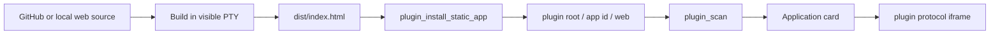
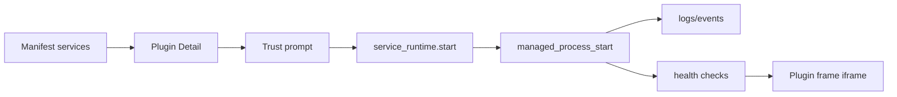

# Runtime 与 Plugin 协议

## 目标

Runtime 协议回答三件事：

1. 一个 app/plugin 怎么被安装、扫描、启动和打开。
2. 一个 sidecar/service 怎么由 Host 托管，而不是由可见终端或插件前端随意启动。
3. 一个 agent/skill/task 怎么解析 provider、运行、发事件、请求审批、记录活动。

## 当前已经成立的能力

来自 `innate-ai-desktop` 的当前实现：

- `iframe-static`：静态 web assets 安装到 plugin root，通过 `plugin://` 或 `http://plugin.localhost` 打开。
- `iframe-sidecar`：过渡形态，打开本地 loopback URL，必要时用 `managed_process_start` 启动 `dev.startCommand`。
- `external-web`：外部网站，默认外部浏览器或 iframe fallback。
- plugin roots：`INNATE_PLUGIN_DIR`、`.innate/plugins`、`appDataDir/plugins`。
- Tauri commands：`plugin_scan()`、`plugin_get_roots()`、`plugin_install_static_app()`。
- low-level managed process：start/status/list/stop + stdout/stderr events。
- workspace commands、PTY terminal、agent/skill/memory runtime 基础。

## Plugin Manifest v1 当前形态

```json
{
  "schemaVersion": "innate.plugin.v1",
  "id": "my-app",
  "name": "My App",
  "version": "0.1.0",
  "runtime": "iframe-static",
  "route": "my-app",
  "entry": { "web": "web/index.html" },
  "homeCard": { "enabled": true, "description": "My app" },
  "ui": {
    "openMode": "iframe",
    "themeMode": "inherit"
  },
  "permissions": ["network:loopback"]
}
```

兼容字段：

- `homeCard` 仍保留，但新 UI contribution 应进入 `ui.*` 或 `contributes.*`。
- `dev.startCommand` 仍保留，但只作为 sidecar 过渡字段。
- `ui.themeMode` 已用于 host theme bridge：`inherit` 或 `isolated`。

## Static Web Plugin Flow



规则：

1. Build command 走可见 PTY，用户能看到输出。
2. 安装命令只复制已构建的 `dist`。
3. 插件静态资源由 Host protocol 代理，不用 `file://`。
4. Plugin iframe 可以继承 Host theme，也可以 isolated。

## Sidecar Web Plugin v1.1 目标

正式目标是 `sidecar-web + services[]`，不再让 `dev.startCommand` 承担全部含义。

```json
{
  "schemaVersion": "innate.plugin.v1",
  "id": "my-local-app",
  "name": "My Local App",
  "version": "0.1.0",
  "runtime": "sidecar-web",
  "route": "my-local-app",
  "entry": {
    "web": "http://127.0.0.1:7460",
    "health": "http://127.0.0.1:7460/health"
  },
  "services": [
    {
      "id": "backend",
      "command": "pnpm --filter @my-app/backend start",
      "cwd": ".",
      "health": "http://127.0.0.1:7459/health",
      "port": 7459
    },
    {
      "id": "web",
      "command": "pnpm --filter @my-app/web dev -- --host 127.0.0.1 --port 7460",
      "cwd": ".",
      "health": "http://127.0.0.1:7460",
      "port": 7460
    }
  ],
  "permissions": ["network:loopback", "process:start"]
}
```

Sidecar flow：



Service runtime 必须提供：

- service group by plugin id。
- start/stop/restart/status。
- health check and retry。
- stdout/stderr log panel。
- process tree stop。
- port conflict detection。
- trust prompt and remembered grants。

## UI Contribution Protocol

Runtime protocol 回答怎么运行，UI contribution 回答显示在哪里。二者分开。

最小目标：

```ts
type UiContribution =
  | { slot: "home.card"; title: string; description?: string }
  | { slot: "shell.nav"; label: string; icon?: string; route: string }
  | { slot: "settings.panel"; label: string; route: string }
  | { slot: "toolbar.action"; actionId: string; placement?: "primary" | "overflow" }
  | { slot: "status.item"; id: string; side: "left" | "right"; priority?: number }
  | { slot: "browser.tool"; toolName: string }
  | { slot: "document.block"; blockType: string };
```

短期第三方 UI：iframe/webview。

短期 first-party UI：source-level package，通过 registry 贡献 React surface，但必须共享依赖版本。

## Plugin UI Theme Bridge

Host 暴露：

- `document.documentElement.dataset.innateTheme`
- `data-theme`
- `.light` / `.dark`
- CSS variables

Iframe plugin 继承主题时，Host 添加 query：

```text
?innateTheme=wandesk&innateColorMode=light&innateResolvedMode=light
```

同时发送 postMessage：

```ts
window.addEventListener("message", (event) => {
  if (event.data?.type !== "innate-theme") return;
  const { themeName, resolvedMode, cssVariables } = event.data.theme;
  document.documentElement.dataset.innateTheme = themeName;
  document.documentElement.classList.toggle("dark", resolvedMode === "dark");
  for (const [name, value] of Object.entries(cssVariables)) {
    document.documentElement.style.setProperty(name, String(value));
  }
});
```

默认策略：

| Runtime | 默认 theme mode |
|---|---|
| `iframe-static` | inherit |
| `iframe-sidecar` / `sidecar-web` | inherit |
| `external-web` | isolated |
| first-party React surface | inherit |

## Agent Runtime Model

Agent provider 应该小而稳定。

```ts
export interface AgentProviderContribution {
  id: string;
  label: string;
  runtime: "cli" | "rpc" | "http" | "sidecar";
  capabilities: AgentCapability[];
  info(ctx: AgentProviderContext): Promise<AgentProviderInfo>;
  run(request: AgentRunRequest, sink: AgentEventSink): Promise<AgentRunResult>;
  cancel(request: AgentCancelRequest): Promise<void>;
  resume?(request: AgentResumeRequest, sink: AgentEventSink): Promise<AgentRunResult>;
}
```

Provider event 需要统一到 Task Activity：

- message delta。
- reasoning delta。
- tool started/completed/failed。
- approval requested/resolved。
- file changed。
- command started/completed。
- run completed/failed/cancelled。

## Provider Store

来自 `innate-desktop-mono` 的 provider store 设计应保留，但作为 Host-owned local SQLite。

关键区分：

```text
Task or Skill -> Execution Profile -> Agent Profile -> Agent CLI + LLM Provider + Model
```

概念：

| 概念 | 说明 |
|---|---|
| Agent CLI | codex、claude、kimi、opencode、aider 等本地执行工具 |
| LLM Provider | OpenAI、Anthropic、Gemini、Ollama、OpenRouter、DeepSeek、custom compatible |
| Agent Profile | CLI + provider + model + reasoning 的组合 |
| Execution Profile | global/workspace/skill/task 级默认值 |

SQLite 表建议：

- `schema_migrations`
- `llm_providers`
- `llm_models`
- `llm_provider_diagnostics`
- `agent_cli_statuses`
- `agent_cli_scan_jobs`
- `agent_profiles`
- `execution_profiles`

Secret policy：

- SQLite 只保存 `api_key_configured`、`api_key_tail`、`secret_ref`。
- raw secret 写入 OS keychain。
- Project export 不包含 secret metadata。

## Skill Runtime

Skill runtime 当前定位：本地 `SKILL.md` 扫描、解析、验证和 agent profile 绑定。

短期目标：

1. 递归扫描 skill roots。
2. 解析 frontmatter 和 Markdown 描述。
3. 生成 `SkillDocument`。
4. 通过 provider store 解析 execution profile。
5. 运行 skill 时发出 Task Activity。
6. 支持 skill pack import/export。

Skill scanner 必须只读，扫描阶段不执行指令。

## Memory Runtime

Memory runtime local-first，先 deterministic search，不急着上 vector/LLM extraction。

Memory scope：

```text
global, workspace, project, agent, skill, task, conversation
```

Memory kind：

```text
fact, preference, decision, summary, instruction, observation, artifact
```

Agent/Skill run 可通过 context block 注入 memory recall 结果。

## Task Runtime Activity Model

统一执行遥测，覆盖所有用户可见工作。

```ts
type TaskSession = { id: string; title: string; workspace?: string };
type TaskRun = { id: string; sessionId: string; status: "running" | "completed" | "failed" | "cancelled" };
type Activity = {
  id: string;
  runId: string;
  kind: string;
  status: "started" | "progress" | "completed" | "failed";
  message?: string;
  payload?: Record<string, unknown>;
};
```

Activity 来源：

- `skill.scan`、`skill.validate`、`skill.run`。
- `agent.run`、`message.delta`、`tool.started`、`approval.requested`。
- `plugin.clone`、`plugin.install`、`plugin.build`、`plugin.register`。
- `workspace.read`、`workspace.write`、`git.status`、`git.commit`。
- `terminal.command`、`service.start`、`service.health`。

## Trust 与 Permission

最小权限模型：

| 权限 | 说明 |
|---|---|
| `workspace:read` | 读取授权 workspace |
| `workspace:write` | 写入授权 workspace |
| `git:read` | status/log/diff |
| `git:write` | branch/commit/apply patch |
| `process:start` | 启动 sidecar/service |
| `terminal:spawn` | 用户可见 PTY 命令 |
| `network:loopback` | localhost service |
| `network:external` | 外部网络 |
| `secret:read:<id>` | 读取某个 secret handle |
| `browser:inspect` | browser page inspect |

规则：

1. Sidecar plugin 首次启动必须确认。
2. Project plugin 默认不自动启用。
3. Tool invocation 按 read/write/execute/network 分级审批。
4. Agent Provider 不等于全权限。sandbox/approval 仍由 Host policy 控制。
5. Frontend plugin 不能直接访问 `window.__TAURI__`。

## 下一步协议工作

1. TS/Rust manifest 同步加入 `entry.health`、`services[]`、`ui.contributions`。
2. `dev.startCommand` 作为 compatibility alias。
3. 建 `service-runtime` 和 Plugin Detail/Runtime Status UI。
4. Provider Store 先做 async CLI scan、secret backend、provider diagnostics。
5. Task Activity 先接 plugin import、skill scan/run、agent run、terminal command。
