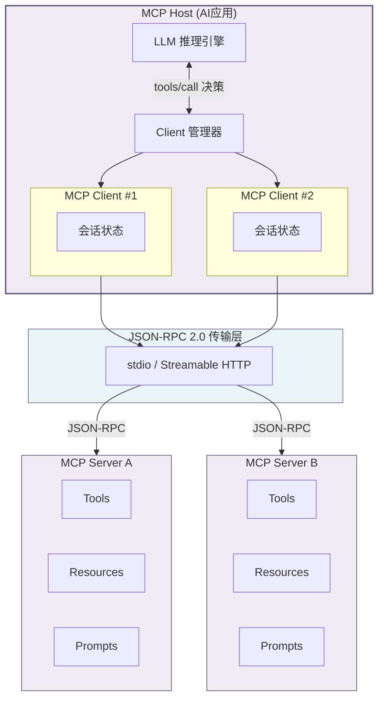

## 2. Plugin架构：MCP成为事实标准

AI Agent（Artificial Intelligence Agent，人工智能代理）的能力边界不仅取决于底层模型的推理质量，更取决于其与外部世界交互的广度与深度。插件（Plugin）架构作为Agent Runtime的"神经系统"，定义了Agent如何发现、调用和管理外部工具。在2024至2026年的短短18个月内，Model Context Protocol（模型上下文协议，MCP）从Anthropic的一项实验性技术提案，跃升为连接AI Agent与外部工具的事实标准。本章从技术架构、生态规模和安全风险三个维度解析MCP的统治地位，并与WASM沙箱模式、传统Extension API模式进行定量对比，为技术选型提供数据依据。

### 2.1 MCP协议技术架构

#### 2.1.1 三层架构解析：Host → Client → Server

MCP采用分层客户端-服务器架构，由三个逻辑层构成 [^72^][^327^][^497^]。**MCP Host**是用户直接交互的AI应用（如Claude Desktop、Cursor、VS Code），负责协调连接、管理安全策略与维护会话状态，内部包含LLM（Large Language Model，大语言模型）和MCP Client管理器。**MCP Client**是Host内部组件，每个Client维护与一个MCP Server的1:1有状态会话连接，承担生命周期管理、认证重试、通知处理和JSON-RPC 2.0消息编解码职责 [^72^][^330^]。**MCP Server**是暴露具体能力的轻量级服务程序，通过标准化协议向Client提供Tools（可执行函数）、Resources（结构化数据）和Prompts（可复用模板），可部署为本地进程或远程服务 [^497^]。

这一设计的核心哲学在于"复杂度的单向转移"——协议明确要求服务器应极其易于构建，Host处理复杂编排；服务器高度可组合且相互隔离，既不能读取完整对话，也无法"窥探"其他服务器 [^493^]。该架构将集成复杂度从$M \times N$（M个Agent需分别对接N个工具）简化为$M + N$（各实现一次MCP协议即可）[^331^]。

**表1：MCP三层架构组件对比**

| 维度 | MCP Host | MCP Client | MCP Server |
|------|----------|------------|------------|
| **核心职责** | 用户交互、LLM推理、安全策略编排 [^72^] | 1:1会话管理、消息编解码、认证重试 [^330^] | 能力暴露：Tools/Resources/Prompts [^497^] |
| **部署模型** | 桌面应用、IDE（Cursor/VS Code） | Host内部库/模块 | 本地子进程（stdio）或远程HTTP服务 [^76^] |
| **状态管理** | 全局会话状态、权限配置 | 每连接会话状态、Capability协商 [^493^] | 无状态或有状态（按实现） |
| **实例比例** | 1个Host实例 | N个Client（每Server 1个） | N个Server（按需连接） |
| **安全角色** | 授权决策中心、权限边界定义 [^329^] | 认证令牌传递 | 执行操作、返回结果 |
| **开发复杂度** | 高（完整协议栈） | 中（SDK封装） | 低（约80行TS代码）[^529^] |

表1清晰展示了MCP通过将复杂度集中于Host层，极大降低了Server端开发门槛。一个最小可行的双工具MCP服务器仅需约80行TypeScript代码，从脚手架到运行约需20分钟 [^529^]。这种不对称设计是MCP生态爆发式增长的关键结构性因素。官方SDK覆盖TypeScript（npm 200万+包访问）、Python（数据科学友好）、Rust（`rmcp`）、Go（`mcp-go`）等主流语言 [^408^]，进一步降低了不同技术栈开发者的接入成本。

#### 2.1.2 三大原语设计哲学：三种独立控制平面

MCP协议定义了三类核心原语，分别对应三种独立的控制平面（Control Plane）[^326^][^328^][^343^]。**Tools**由模型控制（Model-Controlled），是可执行函数，每个Tool通过JSON Schema定义输入参数，并包含自然语言描述和可选的操作注解（`destructiveHint`破坏性操作提示、`readOnlyHint`只读提示、`idempotentHint`幂等提示）[^534^][^535^]。LLM根据Tool描述自主决定何时调用，描述质量直接决定工具发现准确性。**Resources**由应用控制（Application-Controlled），是只读数据源，通过URI标识，客户端可订阅资源变更通知 [^72^][^333^]。**Prompts**由用户控制（User-Controlled），是可复用模板，封装常见交互模式（如"/分析并推荐"），由用户通过UI显式触发 [^344^]。

三种控制平面的分离将"谁决定做什么"这一权限问题从协议层面明确划分：LLM决定何时调用工具，Host决定何时拉取资源，用户决定何时触发模板。这种分离避免了单一控制点的安全隐患，也为不同场景下的权限治理提供了清晰的架构边界。例如，在涉及资金转账的Tool调用场景中，模型可能基于上下文自主发起调用请求，但最终执行权限仍由Host根据用户预设的安全策略进行审核——模型控制"何时请求"，Host控制"是否允许"，两者形成有效的权力制衡。

#### 2.1.3 传输层双轨制：stdio与Streamable HTTP

MCP定义两种标准传输机制，分别覆盖本地开发和生产部署场景 [^76^][^80^][^404^]。**stdio**传输基于标准输入输出流，Server作为Host子进程运行，零网络开销（吞吐量10,000+ ops/s）且零配置，依赖操作系统级进程隔离实现安全 [^76^]。**Streamable HTTP**传输基于HTTP/1.1或HTTP/2，Server作为独立网络服务，支持OAuth 2.1、API Key和mTLS认证，可多租户并发和水平扩展 [^404^]。

传输层的演进反映了MCP从开发工具到企业基础设施的定位转变。2025年3月Streamable HTTP引入，替代了原有的HTTP+SSE（Server-Sent Events，服务器推送事件）方案；2025年11月当前规范仅保留stdio和Streamable HTTP [^404^][^405^]。2026年路线图中传输可扩展性列为最高优先级，IETF Internet-Drafts正探索MCP over QUIC [^404^]。生产环境中，混合模式已成为主流——本地stdio服务器处理文件系统，同时连接上游Streamable HTTP服务器获取云能力 [^405^]。对于个人AI Agent Runtime而言，stdio模式因其零配置特性成为首选启动路径；当需要接入云端能力或多设备同步时，再引入Streamable HTTP作为补充。

### 2.2 MCP生态系统现状

#### 2.2.1 生态规模的量化评估

MCP生态系统的增长速度在开源软件史上罕见。截至2026年Q2，公共注册表收录9,400+服务器，较2025年底增长38%，月增长率维持18% [^412^]。GitHub上带有`mcp-server`标签的仓库达7,800个，其中19,388个验证服务器共包含177,436个独立工具 [^448^]。官方SDK月下载量超9,700万次，npm和PyPI累计下载突破1.5亿 [^459^][^462^]——这一增速是React达到同等规模所用时间的一半 [^462^]。企业采用方面，78%的生产AI团队已在生产环境部署至少一个MCP Agent [^419^]，Fortune 1000中31%已有生产级MCP集成 [^447^]。

上图展示了MCP从2024年11月发布至2026年3月的增长轨迹。月SDK下载量从200万增至9,700万，公共服务器从50个增至9,400个。2025年12月Anthropic将MCP捐赠给Linux Foundation下属的Agentic AI Foundation（AAIF），成为其增长最快的项目之一 [^531^]。截至2026年5月AAIF已拥有190+成员组织 [^457^][^350^]，标志着MCP从单一厂商技术转向社区治理的基础设施标准。

#### 2.2.2 五大类别分布与网络效应

MCP服务器按功能可划分为五大类别。Connectors/SaaS（连接器/软件即服务）类占比最高达38%，涵盖Salesforce、HubSpot、Slack等商业系统连接；开发工具类占27%，包括GitHub、Jira、CI/CD等研发工具；数据/搜索类占18%，覆盖数据库查询和向量检索；系统控制类占8%；创意内容类占5% [^412^]。

Connectors/SaaS以38%的份额主导市场，这一分布与AI Agent在企业工作流中的核心应用场景高度吻合——将LLM的推理能力接入现有业务系统是企业采纳Agent技术的首要驱动力。开发工具类27%的占比反映了AI辅助编程作为当前最成熟Agent应用的市场现实。前三大类别合计占比达83%，生态呈现明显的头部集中特征——既证明了MCP在核心场景中的深度渗透，也意味着长尾场景仍有较大增长空间。每一个新服务器的加入都遵循"梅特卡夫定律"（Metcalfe's Law）逻辑：生态价值随节点数量的平方增长 [^450^]。对个人Agent Runtime而言，这意味着可用的工具集正以指数速度扩展，选择支持MCP的Runtime等同于接入了这一持续扩张的能力网络。

#### 2.2.3 ClawHavoc供应链攻击警示

生态爆发式增长背后隐藏着严峻的安全风险。2026年1月披露的ClawHavoc供应链攻击中，1,184个恶意技能（约占当时OpenClaw生态的20%）被植入信息窃取器，盗取LLM API密钥、SSH密钥和加密货币钱包数据 [^642^][^643^][^650^]。攻击者利用typosquatting（名称仿冒）和排名操纵技术传播恶意载荷 [^647^]。MCP生态面临同构性风险：2026年1月扫描发现35%的MCP服务器在`tools/list`端点无认证 [^421^]，8,000+服务器的安全扫描显示36.7%存在SSRF（Server-Side Request Forgery，服务端请求伪造）漏洞，43%存在不安全命令执行路径 [^407^]。

更深层的风险在于协议本身的安全模型。MCP采用Host为中心架构，协议层不强制执行安全原则 [^329^]。2026年4月OX Security披露MCP SDK的系统性漏洞：配置值直接流入STDIO传输的命令执行，影响约7,000个公共服务器和1.5亿+SDK下载，Anthropic回应为"by design" [^351^]。学术研究进一步证实：6,137个真实服务器中46.4%存在不安全授权行为 [^500^]，o1-mini模型工具投毒攻击成功率达72.8% [^690^]。OWASP 2025年12月发布的Agentic AI Top 10框架中，工具滥用和记忆投毒位列核心风险 [^693^][^696^]。对个人Agent Runtime的技术选型而言，这些安全数据传递了一个明确信号：MCP协议层提供的安全保证不足以应对生产环境中的恶意攻击，必须在Runtime层面实现额外的沙箱隔离和权限管控。

### 2.3 其他Plugin模式对比

MCP并非唯一的Plugin架构方案。WASM（WebAssembly，网页汇编）沙箱模式和传统Extension API模式构成了另外两条重要路线，三种模式在安全性、生态丰富度和集成深度之间形成鲜明权衡。

#### 2.3.1 WASM沙箱模式：安全隔离的新范式

WASM沙箱将插件编译为WebAssembly字节码，在Capability-based Security（基于能力的安全模型）下执行。其安全保证根植于三个底层机制：线性内存模型（零可见外部地址）、受保护调用栈（控制流劫持数学上不可能）和WASI（WebAssembly System Interface）能力模型（零默认访问，显式授权）[^599^][^608^]。性能维度上，WASM冷启动低于1毫秒，内存开销小于1MB，单节点可承载500-1,000实例 [^606^]，对比Firecracker微虚拟机的~125ms启动和~5MB内存具有压倒性延迟优势。

WASM的核心安全特性是默认拒绝（Deny-by-Default）模型——插件启动时无任何系统访问权限，必须显式声明获取特定能力。这与MCP形成互补：MCP定义"Agent如何调用工具"的协议标准，WASM定义"工具可以做什么"的执行边界。Helm 4于2025年采用WASM作为插件执行引擎 [^605^]，标志着该模式进入主流基础设施。

#### 2.3.2 传统Extension API模式：VS Code扩展模型的借鉴与局限

传统Extension API以VS Code扩展系统为典型代表。插件作为Host进程内模块运行，通过Host API访问系统能力。其核心优势是深度集成——插件可直接操作Host内部状态、UI和数据模型。VS Code的30,000+扩展生态证明了Extension API在开发者工具领域的成功 [^172^]。

然而，Extension API模式的安全模型依赖信任假设：插件安装时获得宽泛权限，运行时缺乏细粒度能力隔离。2026年5月Cymulate Research Labs发现的CBSE（Configuration-based Sandbox Escape，配置型沙箱逃逸）漏洞影响了Claude Code、Gemini CLI和Codex CLI等主流工具 [^636^]。对执行不可信代码的AI Agent场景，Extension API的"进程内执行+宽泛权限"模型安全边界不足。

#### 2.3.3 三种模式选型矩阵

**表2：三种Plugin模式选型矩阵**

| 维度 | MCP（协议标准） | WASM沙箱（安全隔离） | Extension API（深度集成） |
|------|----------------|---------------------|------------------------|
| **安全模型** | Host为中心，进程级隔离 [^329^] | Capability-based，数学安全边界 [^599^] | 信任假设，进程内执行 [^636^] |
| **冷启动延迟** | ~10ms（stdio子进程） | <1ms [^606^] | ~0ms（进程内加载） |
| **内存开销** | ~5-10MB/Server | <1MB/实例 [^606^] | 共享Host内存 |
| **生态规模** | 9,400+服务器，1.5亿+下载 [^412^][^459^] | 增长中，Helm 4等采用 [^605^] | VS Code 30,000+扩展 [^172^] |
| **供应商支持** | Anthropic/OpenAI/Google/Microsoft/AWS [^488^] | Bytecode Alliance | 各Host独立实现 |
| **跨Host兼容** | 高（一次编写，到处运行）[^547^] | 中（需WASM运行时） | 低（Host-specific API） |
| **适用场景** | 多工具集成、企业Agent、开放生态 | 不可信代码、高安全场景 | 深度UI集成、可信开发工具 |
| **主要风险** | 供应链攻击、授权绕过 [^351^][^500^] | wasi-nn未标准化 | 沙箱逃逸、权限过度授予 [^636^] |

从表2可得出三条选型结论。第一，对于需要集成大量外部工具、追求生态丰富度的场景，MCP是当前首选——9,400+公共服务器和78%企业采用率 [^419^]构成了难以逾越的网络效应壁垒。MCP的进程隔离模型提供了基础级故障隔离，但在面对恶意代码时安全边界不够坚固。第二，对于执行不可信代码的场景，WASM沙箱提供数学级安全保证，<1ms冷启动和<1MB内存开销 [^606^]使其在性能上同样具备竞争力，生态成熟度是其当前的主要短板。第三，Extension API模式适用于Host与插件在同一信任域管理的场景，其深度集成能力在用户体验维度仍具不可替代性。

从架构演进角度观察，三种模式并非互斥而是呈现融合趋势。最前沿的Agent Runtime已开始采用"MCP + WASM"混合模式——MCP作为工具发现与调用的协议层，WASM作为工具执行的沙箱层。这种分层设计既保留了MCP的生态丰富度，又获得了WASM的安全隔离能力，预计在2027年将成为企业级Agent Runtime的默认架构模式。对个人级轻量级Runtime而言，优先实现MCP协议接入（利用其9,400+服务器生态），同时对关键工具调用引入WASM沙箱隔离，是一条兼顾生态丰富度与安全性的务实路径。
