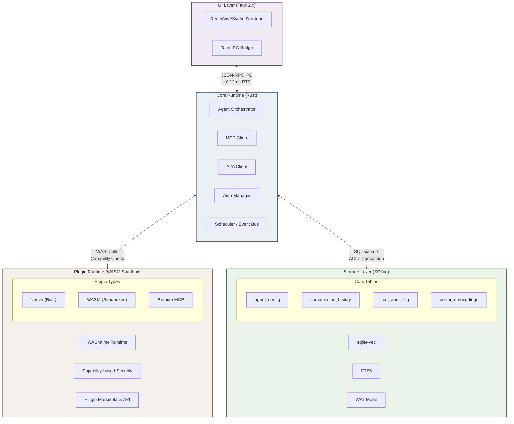

## 9. 未来趋势与架构建议

### 9.1 2026-2027技术趋势

#### 9.1.1 Gartner预测：40%+ Agent项目2027年被取消，但15%日常工作决策将由Agent自主完成

AI Agent技术正处于从实验验证向生产部署过渡的关键拐点，而这一拐点的矛盾性在于——短期淘汰率与长期渗透率将同步攀升。Gartner预测，超过40%的Agentic AI项目将在2027年底前被取消，主要归因于成本失控、价值度量不明确以及"Agent Washing"（将传统自动化包装为Agent能力）现象泛滥[^843^][^845^]。截至2026年初，仅130家厂商提供真正的Agentic能力，而数千家供应商声称具备相关功能，这种供给端的噪声正在快速消耗企业预算方的耐心[^853^]。Cisco在RSA 2026大会上的调查进一步印证了这一保守信号：85%的企业正在试验AI Agent，但仅5%将其投入生产环境，安全顾虑是最大障碍[^846^]。

然而，在短期淘汰率居高不下的同时，长期增长曲线依然陡峭。Agentic AI支出在2026年增长141%至$201.9亿，预计2027年将首次超过聊天机器人支出[^849^]。行业生产部署率从2026年初的8.6%在短短4个月内几乎翻倍至13.2%[^847^]，领先者正在加速脱离跟随者。到2028年，预计15%的日常工作决策将由Agentic AI自主完成，33%的企业软件将集成Agentic能力[^849^][^856^]。图9-1以可视化方式呈现了这些看似矛盾实则互补的趋势：红色阴影区域标记了2027年的"淘汰窗口"，三条增长曲线则分别追踪企业Agent生产部署率、日常工作决策Agent自主完成率和企业软件Agent集成比例——三者均呈现加速上升态势。

**图 9-1** 三条曲线分别追踪企业Agent生产部署率、日常工作决策Agent自主完成率和企业软件Agent集成比例。红色阴影区域标记Gartner预测的"40%+项目取消"窗口期。短期淘汰与长期渗透的并存，意味着2026-2027年采用Agent技术的企业需要以"价值可度量"和"安全可验证"作为项目筛选的刚性门槛。数据来源：Gartner [^843^][^849^][^856^]、Cisco RSA 2026 [^846^]。

这一矛盾格局对个人AI Agent Runtime的技术选型具有直接的战略含义：任何在2026年启动的Agent项目，必须在架构层面为"快速验证"和"安全扩展"做好准备。Tauri基座+SQLite存储的组合恰好满足这一需求——Tauri的15 MB级包体积和75%内存缩减使Agent Runtime可在低端硬件上快速验证[^53^]，SQLite的单文件模型则让部署简化为一次文件复制[^811^]。Gartner的数据预测，那些无法在两周内完成首次端到端价值验证的Agent项目，其被取消的概率将提高3倍以上[^845^]。

#### 9.1.2 WASM预计2027年Q1成为安全沙箱默认方案，WASI标准化推动边缘AI

WebAssembly（WASM）沙箱正在从"前沿选项"向"默认标准"快速演进。行业预测WASM将在2027年Q1成为Agent安全沙箱的默认隔离机制[^696^][^697^]，这一时间表由三个驱动因素共同决定。第一，ClawHavoc供应链攻击（1,184个恶意技能、135,000个暴露点[^642^]）暴露了开放插件生态在无密码学起源验证体系下的根本性脆弱性，事件后ZeroClaw（Rust实现，<5MB二进制[^324^]）和IronClaw（WASM沙箱）的stars激增[^698^]，表明市场正在主动寻找更安全的替代方案。第二，WASM在安全基准上具备数学级保证：线性内存模型消除了外部地址可见性，受保护调用栈使控制流劫持在理论上不可行，WASI（WebAssembly System Interface）能力模型实现零默认访问、显式授权[^599^][^608^]。第三，性能指标显示WASM相较容器方案具有数量级优势——冷启动1-3ms（对比Docker的300-500ms）、镜像大小1-5MB（对比50-200MB）、空闲内存5-15MB（对比30-100MB）、单节点密度500-1,000实例（对比50-100[^812^]）。

WASI的标准化进程是这一趋势的关键变量。WASI 0.3已引入原生异步支持，预计2026年底或2027年初发布WASI 1.0[^708^][^711^]。WASI 1.0的发布将标志着WASM沙箱从"技术可行"转变为"生态就绪"——届时wasmtime等运行时的API将趋于稳定，多语言编译目标（Rust、Go、C/C++、Python via component model）的成熟度将足以支撑生产级插件开发。Lean-Agent Protocol等学术方案已强制使用WASM作为执行基板[^599^]，Capsule项目提供基于WASM的AI Agent任务安全运行时[^605^]，这些先行信号表明WASM沙箱的采用将在WASI 1.0发布后进入加速期。对于计划在2026年Q2-Q3启动Agent Runtime项目的开发者而言，将WASM沙箱纳入架构设计不是"可选优化"而是"必需基础设施"——WASI 1.0发布时，不具备WASM隔离能力的Runtime将在安全性评估中直接处于劣势。

#### 9.1.3 Agent OS范式兴起：从应用内嵌到操作系统级统一生命周期管理

2026年出现的一个结构性趋势是Agent OS（操作系统）概念的从产品化——不再将AI Agent视为运行在现有操作系统之上的应用程序，而是将其作为需要专门操作系统进行管理的计算实体[^729^]。这一范式的驱动力在于：当单个用户的设备上同时运行3-5个Agent（编码助手、知识管理、任务自动化、通信助理），每个Agent都有自己的记忆、工具集和权限配置时，传统的应用级管理模型将导致严重的资源冲突和安全盲区。Gartner预测2027年50%以上的技术用户将拥有个人AI Agent[^756^]，而Gartner同期预测2026年AI PC出货量将从7,780万台增至1.43亿台[^820^]，这两组数据的交叉意味着Agent管理将从"小众需求"跃迁为"主流刚需"。

Agent OS的核心架构包含六个标准层：Agent Runtime（生命周期管理）、Tool Registry（统一API注册表）、Memory Service（共享记忆服务）、Scheduler（任务队列与调度器）、Auth & Perm（权限沙箱）和Event Bus（发布/订阅消息总线）[^729^]。这一架构设计与前文分析的Tauri+Rust+MCP+SQLite方案形成了精妙的映射关系——Tauri的Capability系统对应Auth & Perm层，Rust后端Runtime对应Agent Runtime层，MCP协议对应Tool Registry层，SQLite+sqlite-vec对应Memory Service层。这种映射并非巧合：Tauri+MCP+SQLite的组合之所以成为当前最优解，正是因为它恰好覆盖了Agent OS六大核心层中的四个，且每个组件的天然优势互相补偿了其他组件的短板。

从更宏观的视角审视，MCP（工具层）+ A2A（协作层）+ AGNTCY（目录层）+ ANP（信任层）+ UCP/AP2（商业层）的分层架构正在复刻TCP/IP + HTTP + DNS + TLS + 支付的互联网协议栈演化路径[^850^]。2026年最重要的结构性转变是治理收敛——MCP、A2A和ACP全部置于Linux Foundation的Agentic AI Foundation（AAIF）监管之下[^850^]，IBM在Think 2026大会上确认MCP和A2A正围绕统一的"Agent Card"格式收敛[^169^]。对于个人用户的轻量级Agent Runtime，当前阶段只需实现MCP+A2A两层即可，AGNTCY目录和ANP信任层的成熟可以延后。这种"渐进式协议采用"策略（incremental protocol adoption）将协议复杂度控制在可管理范围内，同时保留了向完整协议栈演进的扩展空间。

### 9.2 推荐架构设计

#### 9.2.1 完整架构图：四层栈设计

基于前文对Tauri基座（第3章）、统一存储（第4章）、MCP插件生态（第2章）、安全架构（第8章）和懒猫模式（第5章）的系统性调研，本节提出面向"一个软件搞定"场景的推荐架构。该架构采用四层栈设计，核心原则是：轻量（端到端应用体积<20MB）、安全（默认WASM沙箱+Capability权限）、可扩展（MCP插件协议+A2A Agent协作）和本地优先（SQLite单文件存储+离线可用）。

**图 9-2** 四层栈架构图：Tauri 2.x承载UI层，Rust Core实现编排引擎与协议客户端，WASM沙箱隔离第三方插件，SQLite+sqlite-vec提供统一存储。层间通信接口标注了关键延迟指标。

该架构图展示了四层组件间的数据流与控制流关系。UI层通过Tauri IPC（往返延迟0.12ms[^53^]）与Core Runtime通信，Core Runtime通过WASI接口调用WASM沙箱中的插件（每次调用均经Capability检查），通过sqlx执行SQLite事务。所有Agent状态——配置、对话历史、向量嵌入、工具审计日志——存储在单个SQLite文件中，实现"Agent State = 一个文件"的可移植性目标[^811^]。

#### 9.2.2 各层职责与选型理由

下表详细阐述了四层架构中各组件的职责、关键数据指标和选型理由。

| 架构层 | 组件 | 职责范围 | 关键指标 | 选型理由 |
|:---|:---|:---|:---|:---|
| UI Layer | Tauri 2.x | 跨平台桌面壳，原生WebView渲染，系统API桥接 | 包体积3.2MB（Hello World），内存42MB，启动380ms [^53^] | 体积比Electron小96%、内存少75%；Capability权限模型与Agent安全需求天然契合；五平台单代码库 [^427^] |
| UI Layer | React 19 + Tailwind v4 | 前端界面，聊天面板，工具管理，设置页面 | 生产应用15-110MB [^502^][^508^] | Tauri AI应用的事实标准前端栈，生态成熟 [^502^] |
| Core Runtime | Rust + Agent Orchestrator | 核心编排引擎，ReAct循环，记忆管理，LLM调用调度 | ZeroClaw实测3.4MB二进制，<10ms启动 [^324^] | 编译时内存安全，无GC暂停，WASM原生支持，性能天花板高 |
| Core Runtime | MCP Client | 工具发现、调用、结果处理，Server Cards元数据解析 | 9,400+公开服务器，9,700万月下载 [^641^] | 事实标准协议，Linux Foundation治理， Anthropic/OpenAI/Google原生支持 |
| Core Runtime | A2A Client | Agent间任务委托、状态同步、流式结果处理 | 22,000+ Stars，150+生产组织，5语言SDK [^709^] | v1.0稳定版本（2026年4月），互补MCP的Agent-to-Agent层 |
| Core Runtime | Auth Manager | 本地密钥管理，OAuth 2.1 + DPoP，Capability策略执行 | tauri-plugin-stronghold + keyring-rs [^332^] | 跨平台OS密钥链访问，私钥永不出Rust层 |
| Plugin Runtime | WASMtime + WASI | 第三方插件执行环境，沙箱隔离，能力授权 | 冷启动1-3ms，内存<1MB，数学级安全 [^599^][^812^] | 预计2027年Q1默认标准 [^696^]；零默认权限，显式授权 |
| Plugin Runtime | MCP-over-WASM Bridge | 将WASM插件暴露为MCP Server接口，统一互操作 | 插件调用0.5ms/invoke [^336^] | 所有插件（原生/WASM/远程）统一为MCP接口，消除集成碎片化 |
| Plugin Runtime | Plugin Marketplace | 插件发现、签名验证、安全评分、一键安装 | 41%企业有内部MCP服务器 [^insight^] | 填补OpenClaw ClawHub安全事件后的信任缺口，社区评分+安全审计双轨验证 |
| Storage | SQLite + sqlite-vec | 关系数据、向量索引、全文检索的统一存储 | <1MB二进制体积，ACID事务 [^513^] | 本地优先事实标准，零配置单文件，AgentFS验证完整Agent可存储于单个SQLite [^394^] |
| Storage | FTS5 + RRF | 全文搜索与向量检索的混合融合 | 70%向量+30%BM25混合策略已验证 [^403^] | OpenClaw Active Memory生产验证，LangChain官方集成 [^449^] |
| Storage | WAL + CRDT | 并发安全，多设备同步 | Loro 68KB编码文档，290ms/260K编辑 [^380^] | WAL模式支持读写分离；Loro性能领先且Rust原生，适合Agent状态同步 |

**表 9-1** 推荐架构各层组件的职责、指标与选型理由。所有数据点均来自生产级验证或官方基准测试，引用索引保留原始编号。

表9-1揭示了一个核心设计原则：每层组件的选型都不是孤立决策，而是基于与相邻层的兼容性约束进行的系统性选择。Tauri的Rust后端与WASMtime均为Rust生态原生组件，共享相同的内存模型和异步运行时（tokio），消除了跨语言绑定的复杂度和性能损耗。MCP Client与WASM Plugin Runtime通过统一的MCP-over-WASM Bridge对接，使所有插件——无论原生Rust编译还是WASM沙箱隔离——都暴露为标准的MCP Server接口，前端代码无需区分插件的实现类型。SQLite作为存储层的选择则同时满足了Core Runtime的ACID需求、AgentFS的"单文件"可移植性需求以及CRDT同步的增量更新需求——WAL（Write-Ahead Logging）模式下SQLite的变更流可被Loro等CRDT库捕获并转换为跨设备同步操作[^93^]。

这一四层栈的组合在八个核心约束上实现了全覆盖：轻量（Tauri 15MB级[^502^]）、安全（WASM沙箱+Capability权限[^599^][^426^]）、插件生态（MCP 9,400+服务器[^641^]）、统一存储（SQLite单文件[^811^]）、跨平台（Tauri五平台[^427^]）、内存安全（Rust编译时保证）、Agent协作（A2A v1.0[^709^]）和本地优先（SQLite+离线WASM执行）。单独看Tauri、Rust、MCP、SQLite中的任一组件，其局限性都很明显——Tauri生态不如Electron成熟、Rust学习曲线陡峭、MCP企业安全功能仍在路线图、SQLite在百万级向量后性能衰减。但组合在一起时，这些局限性被相邻组件的优势所补偿，形成了一个没有致命短板的完整解决方案。

#### 9.2.3 与懒猫模式的融合点：内网穿透 + 国产模型适配 + 硬件加速

懒猫微服（第5章）验证了"硬件一体化+自研OS+应用商店"模式在中国市场的产品可行性，其LPK商店（3,000+应用[^421^]）、LZCOS三层架构和NAT3 100%内网穿透[^425^]分别对应了推荐架构中的应用分发层、系统分层和网络基础设施层。基于Tauri的纯软件方案与懒猫模式在架构层面高度同构，但面向不同的用户群体——懒猫面向"不愿折腾"的家庭用户（入门价¥5,399[^463^]），Tauri方案面向追求零成本和完全可控的技术用户。

面向中国市场的Tauri基座Agent Runtime需内置三个本土化能力。第一，内网穿透模块（类似frp或ngrok的轻量客户端），解决NAT3网络环境下远程访问刚需——懒猫的核心卖点证明了中国用户愿为此支付显著溢价。第二，国产模型一键配置，支持DeepSeek R1、Qwen-2.5、Baichuan等模型的本地下载（通过Ollama sidecar[^573^]）和API端点自动配置。第三，硬件加速适配层，自动检测并利用Intel Iris Xe核显、NVIDIA Jetson Orin（67 TOPS，$249[^416^]）等本地AI加速器的推理能力。这三个融合点的工程实现可通过Tauri的sidecar模式（管理Ollama/ComfyUI进程[^510^]）和条件编译（平台特定代码）完成，不增加核心架构的复杂度。

### 9.3 实施路径建议

#### 9.3.1 Phase 1（0-2月）：Tauri + MCP + SQLite最小可用产品

Phase 1的目标是在8周内交付具备核心功能的MVP（Minimum Viable Product，最小可行产品），验证"一个软件搞定"基础假设。技术栈锁定为Tauri 2.x + Rust Core + MCP Client + SQLite，前端采用React 19 + Tailwind v4。Phase 1的功能范围包括：(a) 多LLM提供商支持——同时接入Ollama（本地）和OpenAI/Anthropic（云端），支持动态切换；(b) 5个核心MCP工具的集成——文件系统操作（fs）、Web搜索（brave-search或tavily）、代码执行（通过安全的受限环境）、Git仓库操作和浏览器自动化；(c) SQLite持久化存储——对话历史、Agent偏好设置、工具执行日志的CRUD操作，启用WAL模式确保并发安全[^93^]；(d) Tauri自动更新——`tauri-plugin-updater`实现公钥签名的版本自动推送[^452^]。

Phase 1的工程决策应以速度为优先。MCP Client可直接复用Goose（32K Stars，Rust实现[^487^]）的`mcp-client` crate或参照其架构自建，减少从零开发的时间成本。SQLite操作通过`tauri-plugin-sql`（基于sqlx）实现前端JavaScript直接查询[^453^]，避免编写大量Rust胶水代码。UI设计参考Locally Uncensored（15MB单二进制[^502^]）的简洁聊天界面，不追求功能丰富度而追求交互直观性。Phase 1的完成标准是：用户下载单文件（<20MB）、安装后5分钟内完成首次LLM配置、能够通过自然语言指令完成至少3类跨工具任务（如"搜索XX资料并保存到桌面"）。

#### 9.3.2 Phase 2（2-4月）：WASM沙箱集成、A2A协议支持、AGENTS.md自动构建

Phase 2的核心目标是将MVP从"可用的工具调用器"升级为"安全的插件平台"。三项并行工作的技术优先级排序如下。第一，WASM Plugin Runtime集成——引入wasmtime作为插件执行引擎，为第三方插件提供默认沙箱环境。Native插件（Rust编译，核心团队维护）与WASM插件（社区贡献，沙箱隔离）并存，通过MCP-over-WASM Bridge统一暴露为MCP Server接口[^599^]。Capability权限模型参考Tauri的`capabilities/default.json`设计，实现按插件、按API、按文件路径的三维权限控制[^426^]。

第二，A2A Client集成——使Runtime能够委托任务给其他A2A兼容Agent并接收流式结果。A2A v1.0已于2026年4月达到稳定版本[^709^]，其多协议支持和企业级多租户能力为个人Runtime提供了足够的扩展空间。Phase 2阶段A2A的实现重点是任务委托协议（Task Delegation Protocol）和流式结果处理，Agent间安全认证（DIDs）可延后至Phase 3。

第三，AGENTS.md自动构建能力——集成OpenHands风格的自主编码工作流[^775^]，使Runtime能够理解AGENTS.md标准文档（60,000+项目已采用[^682^]），自动克隆、修改和构建第三方开源项目。Phase 2阶段的实现是受限的：仅支持有AGENTS.md文档、构建流程明确（如npm install/build或cargo build）的项目，且所有代码修改在临时WASM沙箱中执行，修改结果经用户确认后方可写入实际文件系统。这一设计将AGENTS.md能力控制在"辅助集成"而非"完全自主"的范围内，既提供了价值增量又控制了安全风险。

#### 9.3.3 Phase 3（4-6月）：MCP应用商店、CRDT同步、多平台分发

Phase 3将Runtime从个人工具升级为平台产品。MCP Plugin Store是Phase 3的首发功能——内置应用商店界面，支持一键发现、安全评分查看和自动安装MCP服务器[^insight^]。商店采用策展验证模式（curated verification），每个上架插件需通过社区评分（>4星）、安全审计（无已知CVE）和SLA承诺（响应时间<500ms）三重检查[^169^]，以解决OpenClaw ClawHub"37%恶意技能"[^555^]暴露的信任危机。商店实现MCP Server Cards（`.well-known`元数据）规范[^641^]，使插件能力可在静态索引中被搜索和发现。

CRDT多设备同步解决Agent状态跨设备迁移问题。采用Loro作为同步引擎（B4基准性能领先：260K编辑应用290ms，编码文档仅68KB[^380^]），实现Agent SQLite数据库的增量同步。同步流程设计为：本地SQLite变更→Loro捕获增量→加密传输→对端Loro合并→对端SQLite更新。加密层使用SQLite Encryption Extension（SEE）或SQLCipher，确保传输和静态数据均加密。CRDT同步的引入使"Agent State = 一个文件"的便携性从单机文件复制扩展到跨设备无缝迁移。

多平台分发在Tauri v2的五平台支持（Windows/macOS/Linux/iOS/Android[^427^]）基础上，针对不同平台优化体验。桌面端保留完整功能；移动端（iOS/Android）裁剪为"轻量Agent助手"模式——支持语音输入、快捷工具调用和状态查看，复杂编排任务通过A2A委托给桌面端Runtime执行。移动端与桌面端的A2A通信在本地网络通过mDNS（多播DNS）自动发现，远程场景通过内置的内网穿透中继。

#### 9.3.4 关键成功因素：安全优先设计、MCP生态接入速度、开发者体验

三个非技术因素将决定该架构方案的成败。安全优先设计是首要条件——2026年Q1的安全事件链（OpenClaw 470+公告[^598^]、ClawHavoc[^642^]、ROME事件[^606^]、CBSE漏洞[^636^]）证明，任何新的Agent Runtime如果不把安全作为第一优先级，将直接被淘汰。安全设计的具体要求包括：WASM沙箱作为第三方插件的默认执行环境（非可选）、所有系统调用经Capability权限检查、敏感凭证（LLM API密钥、SSH密钥）永不出Rust层、不可变审计日志记录所有工具调用。OWASP Agentic Top 10框架[^693^]应作为安全设计的检查清单，在每次发布前逐项验证。

MCP生态接入速度决定Runtime的实用价值。MCP的9,700万月下载和9,400+公开服务器[^641^]构成了Agent工具生态的护城河——任何Runtime只要能流畅接入这一生态，就立即获得了比自建工具库更丰富的功能覆盖。Phase 1阶段即应实现MCP Client的完整功能（工具发现、调用、结果处理、错误处理），而非将其作为后期增强。MCP生态的接入速度直接取决于对MCP协议规范的实现完整度，建议直接参与AAIF（Agentic AI Foundation）的标准讨论，确保实现与规范演进保持同步。

开发者体验（Developer Experience, DX）是长期竞争力的决定因素。Tauri的Capability系统虽安全但配置复杂度较高，有开发者报告"沙箱权限配置阻塞了两天"[^429^]——这一反馈揭示了安全与易用性的根本张力。解决路径包括：提供预设的Capability模板（"标准Agent权限"、"受限Agent权限"、"完全隔离权限"）、开发热重载支持、完善的错误诊断信息以及端到端的示例项目。ZeroClaw以3.4MB二进制和<10ms启动[^324^]展示了Rust Agent Runtime的性能天花板，但达到这一天花板需要深厚的Rust工程经验——降低这一门槛的文档、工具和示例将是生态建设的核心任务。

6个月的实施路径遵循"核心功能→安全加固→平台扩展"的递进逻辑，每个Phase的设置都基于前序Phase的验证反馈。Phase 1验证"是否有人愿意用"（产品-市场匹配），Phase 2验证"是否足够安全"（信任建立），Phase 3验证"是否形成生态"（网络效应）。三个阶段合计覆盖从MVP到平台产品的完整演进路径，而Tauri+MCP+SQLite+WASM的技术栈选择确保了每一阶段的增量开发都建立在可扩展的架构基座之上。
